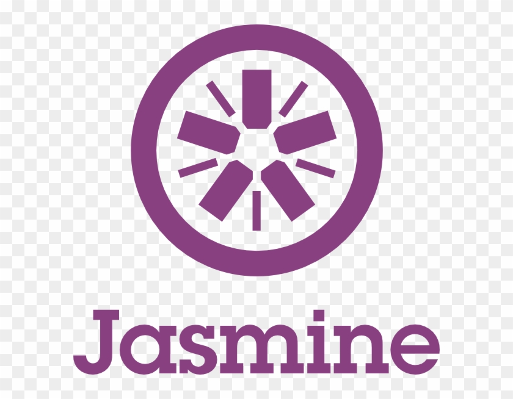

hi, i'm [Tina Lu](https://www.linkedin.com/in/tina-liaoning/), a passionate SDET (Software Developer in Test) from Canada.
my passion for software quality drives me to explore new tools and technologies.

I am also an open-source enthusiast and maintainer. I learned a lot from the open-source community and I love how collaboration and knowledge sharing happened through open-source.


  
  
- 💼 Any challengin task? do reach, [email](mailto:tina.liaoning@gmail.com) :)
- 💬 ask me anything about QA, i am happy to help;

**languages and tools:**  

<code></code>
<code></code>
<code></code>
<code></code>
<code></code>
<code></code>
<code></code>
<code></code>
<code></code>
<code></code>
<code></code>
<code></code>
<code></code>
<code></code>
<code></code>
<code></code>
<code></code>
<code></code>
<code></code>
<code></code>
<code></code>
<code></code>


📊 **this week i spent my time on:**
<!--START_SECTION:waka-->

```txt
Java         150 mins        █████████████████░░░░░░░░   61.79 %
Appium       29 mins         █████▓░░░░░░░░░░░░░░░░░░░   16.04 %
JavaScript   28 mins         █████▒░░░░░░░░░░░░░░░░░░░   15.07 %
Bash         11 mins         ██░░░░░░░░░░░░░░░░░░░░░░░   04.66 %
Other        8 mins          █▓░░░░░░░░░░░░░░░░░░░░░░░   02.43 %
```

<!--END_SECTION:waka-->

🚧 **my todoist stats:**
<!-- TODO-IST:START -->
🏆  8,004 Karma Points           
🌸  Completed 0 tasks today           
✅  Completed 673 tasks so far           
⏳  Longest streak is 10 days
<!-- TODO-IST:END -->

📈 my github stats

<p align="center"> 


